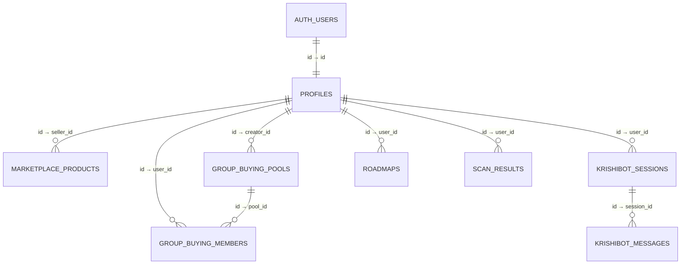

# BharatFarm — Supabase Architecture

## Overview

BharatFarm uses Supabase PostgreSQL as its persistent database layer. The Express backend communicates with Supabase through the `@supabase/supabase-js` client library, accessed exclusively via the Repository layer in the server-side architecture.

```
React Client → Express API → Controller → Service → Repository → Supabase PostgreSQL
```

No sensitive database operations bypass the Express backend.

## Database Tables

### Entity Relationship Diagram



### Table Summary

| Table | PK Type | RLS | Purpose |
|---|---|---|---|
| `profiles` | UUID (auth.users FK) | ✅ | User profile data |
| `marketplace_products` | UUID | ✅ | Product listings |
| `group_buying_pools` | UUID | ✅ | Bulk buying pools |
| `group_buying_members` | UUID | ✅ | Pool membership |
| `schemes` | TEXT (slug) | ✅ | Government schemes |
| `krishibot_sessions` | UUID | ✅ | Chat sessions |
| `krishibot_messages` | UUID | ✅ | Chat messages |
| `roadmaps` | UUID | ✅ | AI crop roadmaps |
| `scan_results` | UUID | ✅ | Leaf scan history |

## RLS Strategy

- **profiles**: Users can only read/update their own profile
- **marketplace_products**: Public read, seller-owned write
- **group_buying_pools**: Public read, authenticated create, creator-owned update
- **group_buying_members**: Public read, self-insert only
- **schemes**: Public read, service-role-only write
- **krishibot_sessions/messages**: Users can only access their own sessions
- **roadmaps**: Users can only access their own roadmaps
- **scan_results**: Users can only access their own scan history

The Express server uses the service-role key (bypasses RLS) for privileged operations like seeding schemes or admin queries.

## Environment Variables

| Variable | Required | Usage |
|---|---|---|
| `SUPABASE_URL` | Yes | Supabase project URL |
| `SUPABASE_ANON_KEY` | Yes (or publishable) | Public/anon API key |
| `SUPABASE_SERVICE_ROLE_KEY` | Production | Privileged server key (bypasses RLS) |

The server also accepts `SUPABASE_PUBLISHABLE_KEY` as an alias for `SUPABASE_ANON_KEY`.

## Migration Workflow

Migration files are stored in `supabase/migrations/` and are numbered sequentially:

```
supabase/migrations/
├── 001_create_profiles.sql
├── 002_create_marketplace_products.sql
├── 003_create_group_buying.sql
├── 004_create_schemes.sql
├── 005_create_krishibot.sql
├── 006_create_roadmaps.sql
└── 007_create_scan_results.sql
```

These have already been applied to the remote Supabase project via the Supabase MCP.

## Local Development

The application runs without Supabase when `USE_MOCK_DATA=true`. In this mode, repositories use in-memory arrays. The Supabase client returns `null` when credentials are missing, and the server logs a warning but continues operating.

## Production Configuration

On Render, set the following environment variables:
- `SUPABASE_URL`
- `SUPABASE_ANON_KEY`
- `SUPABASE_SERVICE_ROLE_KEY`
- `USE_MOCK_DATA=false`

## Future Module Migration

Each module will be migrated separately from in-memory arrays to Supabase queries:

1. **Authentication** → Supabase Auth + profiles table
2. **Marketplace** → marketplace_products table
3. **Group Buying** → group_buying_pools + group_buying_members tables
4. **Schemes** → schemes table (seed data)
5. **KrishiBot** → krishibot_sessions + krishibot_messages tables
6. **Roadmap** → roadmaps table
7. **Scanner** → scan_results table
8. **Offline sync** → conflict resolution layer
